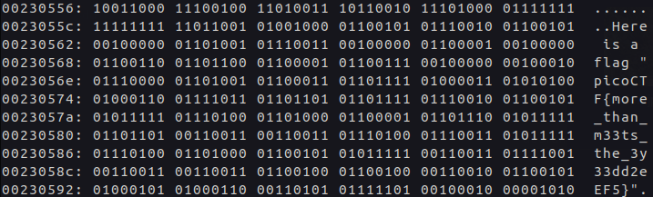

# Glory of the Garden

**Platform:** PicoCTF&#x20;

**Difficulty: **<mark style="color:green;">**easy**</mark>

***

### Description

This [garden](https://jupiter.challenges.picoctf.org/static/4153422e18d40363e7ffc7e15a108683/garden.jpg) contains more than it seems.

<figure><figcaption>
garden.jpg
</figcaption></figure>

### Resolution

When we look at this file in the shell. Simply using  `file garden.jpg` does not get us anything useful.

`garden.jpg: JPEG image data, JFIF standard 1.01, resolution (DPI), density 72x72, segment length 16, baseline, precision 8, 2999x2249, components 3`

We can see that it is a binary file. From that, we can use the command `xxd -b garden.jpg` or simply `strings garden.jpg` and the flag is simply printed out.

<figure><figcaption></figcaption></figure>

**Flag:** picoCTF{more\_than\_m33ts\_the\_3y33dd2eEF5}
