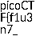
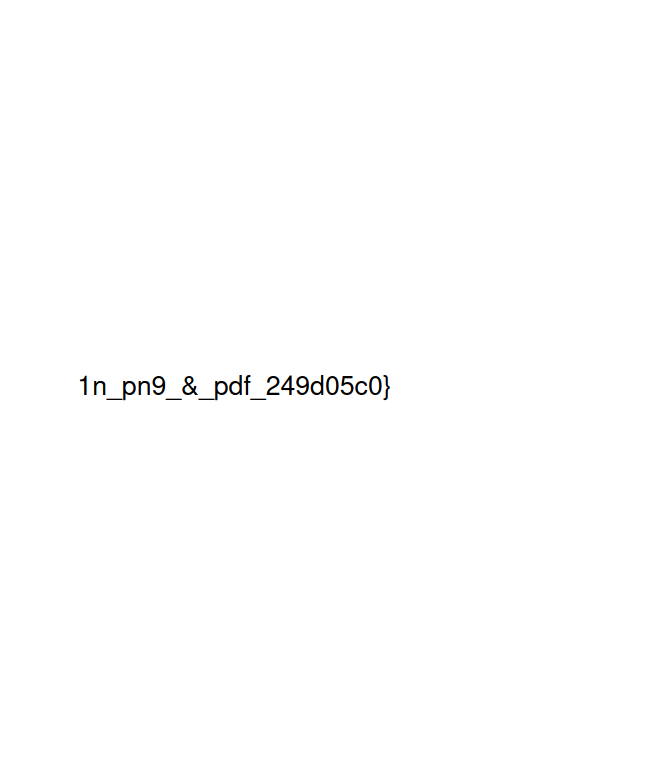

# Secret of the Polyglot

**Platform:** PicoCTF&#x20;

**Difficulty: **<mark style="color:green;">**easy**</mark>

***

### Description

The Network Operations Center (NOC) of your local institution picked up a suspicious file, they're getting conflicting information on what type of file it is. They've brought you in as an external expert to examine the file. Can you extract all the information from this strange file? Download the suspicious file [here](https://artifacts.picoctf.net/c\_titan/8/flag2of2-final.pdf).

### Resolution

Lets take a look of the file in the terminal using&#x20;

```
file flag2of2-final.pdf
```

`flag2of2-final.pdf: PNG image data, 50 x 50, 8-bit/color RGBA, non-interlaced`


It seems the extension indicates it is a PDF file but the contents of the file is PNG image file. We can change the extension the file to PNG and check it.

```
mv flag2of2-final.pdf flag2of2-final.png
```

And now lets see the content of the png file

```
open flag2of2-final.png
```

<figure><figcaption></figcaption></figure>

Looks like that's the first part of the flag. The second part might be the one that is written in the pdf file

<figure><figcaption><p>flag2of2-final.pdf</p></figcaption></figure>

To get the content from the pdf we can use

```
pdftotext flag2of2-final.pdf outt.txt 
cat outt.txt 

1n_pn9_&_pdf_249d05c0}
```

By merging the two parts we get the following flag:

**Flag:** picoCTF{f1u3n7\_1n\_pn9\_&\_pdf\_249d05c0}
