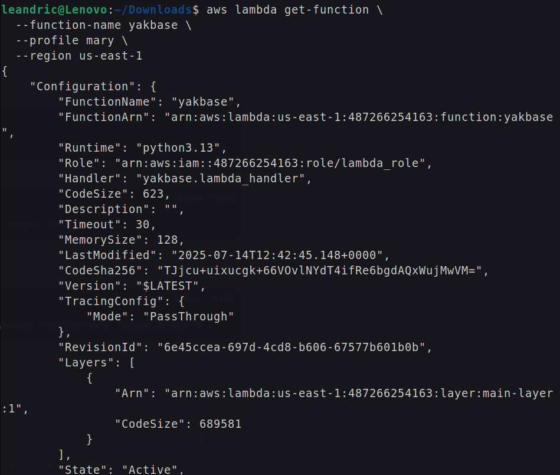

# Ruski Malware 1

**Platform:** FCUP , Internal CTF TPAS

**Difficulty: **<mark style="color:green;">**easy**</mark>

***

### Description

Can you find the C\&C server?

Check the attached file. You have binaries built for multiple distributions. If you need to request a binary for your distribution, please let us know.

Segmentation faults occur in some distributions. Find what packer is being used and extract the original binary.


### Resolution

Lets take a look of the file in the terminal.

<figure><figcaption></figcaption></figure>

Being just a zip file, we can unzip it using

```
unzip ruski-malware.zip -d extracted_ruski
```

<figure><figcaption></figcaption></figure>

We can get into our new folder `extracted_ruski` and take a look into the hidden files using `cat`

<figure><figcaption></figcaption></figure>

<figure><figcaption></figcaption></figure>

&#x20;I also used `strings` command into the `ruski-malware` since it is possible to view the human-readable characters within a file, this will help me find any hints of a flag before using a disassembler.

<figure><figcaption></figcaption></figure>

The statement **"This file is packed"....** captured my attention. The executable was packed using Upx packer. Upx packer compresses and packs executables ,the reason for this is to hinder dissasembly of executables or even hide the intent of the program especially for maware authors. [https://tech-zealots.com/reverse-engineering/dissecting-manual-unpacking-of-a-upx-packed-file/](https://tech-zealots.com/reverse-engineering/dissecting-manual-unpacking-of-a-upx-packed-file/)


So, I searched online on how to unpack upx packed executable . I downloaded upx from their github repo [https://github.com/upx/upx/releases/tag/v4.2.4](https://github.com/upx/upx/releases/tag/v4.2.4) and set up the executable as below.

```
tar -xvf upx-4.2.4-amd64_linux.tar.xz
cd upx-4.2.4-amd64_linux/
sudo mv upx /usr/local/bin/
```

<figure><figcaption></figcaption></figure>

Now its possible to unpack the code with the following command:

```
upx -d ruski-malware
```


After looking for the unpacked code I found some hints into the function FUN\_001014c1.

<figure><figcaption><p>FUN_001014c1</p></figcaption></figure>

This part of code really sells a known website with&#x20;

`http://tpas.alunos.dcc.fc.up.pt/[decoded_string].txt`

after decoding the string saved in `local_48` I got `51425f96ccc6c68c978bae22a018b1e87b63bf3e`. Combining the given link with the saved string, we could access the following link:

http://tpas.alunos.dcc.fc.up.pt/51425f96ccc6c68c978bae22a018b1e87b63bf3e.txt\
which had the flag written.


**Flag:** TPAS{1\_hav3\_f0und\_th3\_C\&C}
